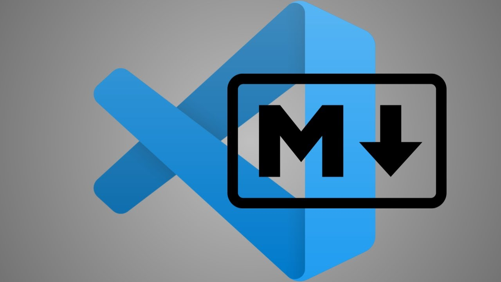

# Основные команды первого семинара

> **git init** - инициализация локального репозитория

> **git status** - получит информацию от Git о его текушем состоянии

> **git add** - добавить файл или файлы к следующему коммиту

> **git commit -m “message”** – создание коммита

> **git log** – вывод на экран истории всех коммитов с их хеш-кодами

> **git checkout** – переход от одного коммита к другому

> **git checkout master** – вернуться к актуальному состоянию и продолжить работу

> **git diff** – увидеть разницу между текущим файлом и закоммиченным файлом
***
> [Программирование — Википедия](https://ru.wikipedia.org/wiki/Программирование "Материал из Википедии — свободной энциклопедии")
***
> 
